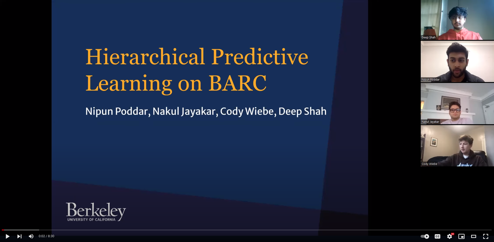

The project is an innovative venture focused on advancing autonomous racing through the development and refinement of a Hierarchical Predictive Learning (HPL) algorithm to serve as a low level filter for the Model Predictive Control Algorithm. The team's goal was to adapt the HPL algorithm for smaller race tracks, enabling the prediction of track curvature using onboard camera vision, and actualizing a basic MPC controller on the Berkeley Autonomous Race Car (BARC). This endeavor is not just a technological pursuit but also contributes to the broader scope of autonomous driving, enhancing vehicle comfort in commercial applications and exploring the entertainment potential of autonomous racing.

Throughout the project's lifecycle, the team adopted a systematic approach, beginning with a well-thought-out design phase. We meticulously planned the ideal system design and made critical design decisions for the initial simulation. Recognizing the constraints and challenges, we adapted their functional system design accordingly, ensuring a pragmatic and feasible approach.

The implementation phase saw the translation of design into reality. Although the majority of the software used to develop the MPC simulation in our project was previously developed by Dr. Charlott S Vallon. The code lacked robust control over newer tracks. We skillfully integrated physical systems, wrote new programs and functions basing our model on a kinematic bicycle model, making use of tools such as CasaADi and ROS, and deployed the code to bring the system to life. This phase was characterized by a blend of innovation, technical proficiency, and practical problem-solving.

The most important script written to drive the BARC vehicle was the ROS wrapper of the MPC controller itself. In the simulation code base we used the MPC is structured by calling an optimization problem in a while loop using current position and track curvature predictions from a map of the tracks coordinates. In our ROS file we use MOCAP data along with data of our given track to locate the car on the track. With the cars location on the track we then give it the future positions of the upcoming track. From there the MPC described above is computed to gather the optimal inputs to keep the BARC on the centerline for the next N steps. The first input step is then sent to the BARC and the MPC is recalculated at the next step.

Consequently, in simulation, we were able to get optimal performance for the total system. This means that we were able to simulate the BARC following the optimal race line with the optimal speeds to slow around corners and speed straightaways. If the BARC were to follow this simulated performance it would achieve a high lap speed while starting and stopping at the tracks finish line.

Despite facing challenges such as limited lab time and access, which affected our ability to fully realize the project, the team demonstrated remarkable adaptability and resilience. We successfully developed a functional MPC (Model Predictive Control) algorithm. Although a critical error in the race track map impeded the car from following the intended path, the team's success in simulations showcased the optimal performance of the BARC, adhering to the optimal race line with varying speeds for corners and straightaways.

In conclusion, this project stands as a testament to the team's dedication to pushing the boundaries of autonomous vehicle technology. It highlights their adaptability, technical acumen, and unwavering commitment to innovation. The project not only underscores the feasibility of the MPC algorithm for autonomous racing but also paves the way for future advancements in the field.

Here is a compile video of multiple failed runs of the BARC.

<!-- [Video will open in Youtube](https://youtube.com/shorts/szupxQCVs8o) -->

Further, you can also look at the video presentation for this project from our team.

<!-- [Video will open in Youtube](https://youtu.be/sZ3SI0buOtM) -->